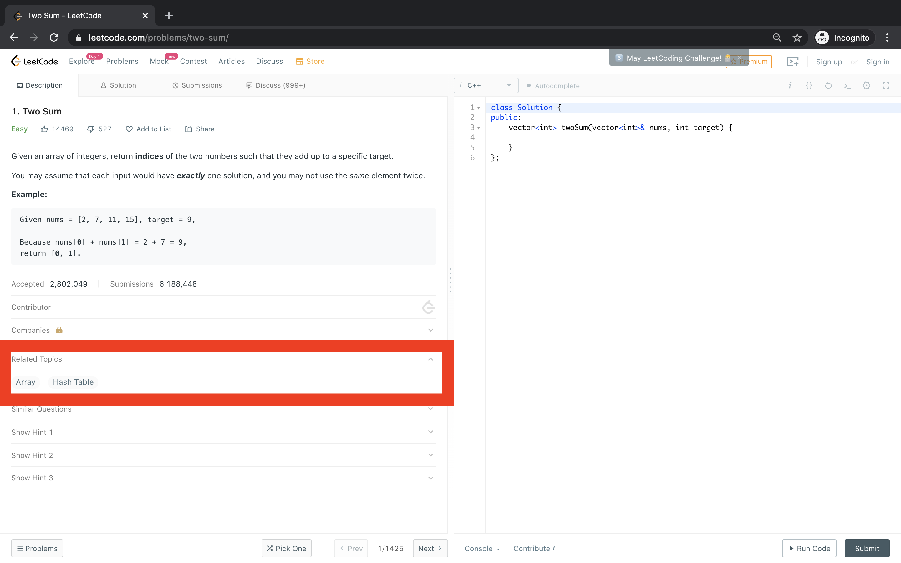
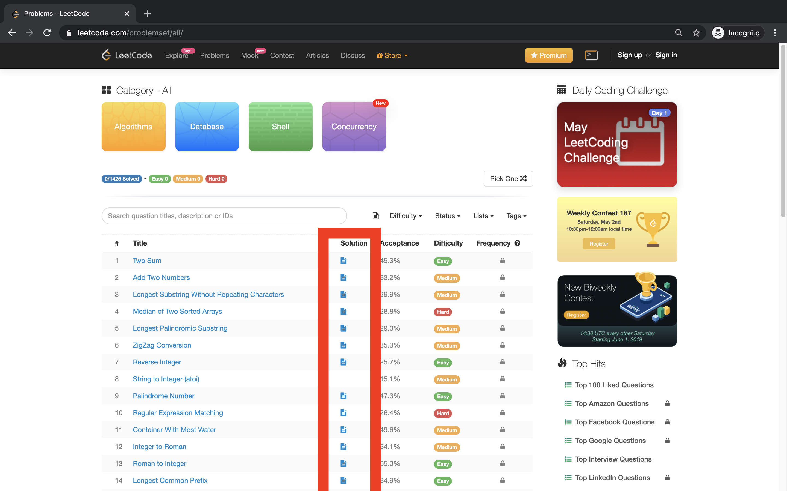

# My personal guide to Leetcode

## Some background

I started doing Leetcode in early 2017 right after I was done with school, and right before University started. At that time I was just learning Python 3 on edX using MIT's 6.00.1x online offering, and started off doing Leetcode as a way to practice and sharpen my Python skills. 

Since then I've tried to remain consistent and never to be more than a few week's worth of effort away from my peak performance to get ready for interviews. Being part of the University of Waterloo's co-op programs really puts you in the rhythm of always being ready to interview at a few days notice, and its helped me be consistent in keeping up with this habit.

At the time of writing, I've done 522 problems out of the 1425 total, out of which 494 of them from the Algorithm section akin to a normal interview, with the rest being from the Database section. I've participated in 26 contests and counting, and currently rank at 2192 out of the 93873 leetcode members on the global scoreboard.

## The GUIDE!

Obviously this guide is only a recommendation, and derives from personal experience with what worked for me. If you have something that works for you, by all means strive on!

### Which problems to start with?

To get an overarching sense of where you stand conceptually in your knowledge of algorithms and common patterns to solve problems, I'd suggest trying to solve problems from this list [here](https://leetcode.com/problemset/top-interview-questions/) that includes questions from varying levels of difficulty and topics.

Sort the problems by the "Acceptance" column in decreasing order, and use that as a measure of how difficult the problem is instead of using the Leetcode difficult tags.  Start with the problems that have a higher acceptance rate and work your way up in difficulty, don't worry if you cannot solve all the problems, it is just to get a sense of where of you stand.

When you do each problem, note down what its "Related topics" are. This will be useful in figuring out what topics you are more confident in, and which ones need more practice.

### What to do when you get stuck on problems?

Some leetcode problems have written editorials on them that go through the motions of explaining the thinking behind their approaches, expanding on their time and space complexities as well as showing you the code so that you can see the implementation for yourself. They generally offer multiple approaches for each problem, with some that manage to pass the Time Limit \(i.e. have good time complexity\) on leetcode or some that fail the same. In the list view, the problems that have a document under the "Solution" column, have an editorial attached to them.

Since most problems do not have editorials written, the alternate way of finding the solution to the problem is looking at the "Discuss" tab for each question. You can always find people sharing their solutions, approaches and explanations for different languages. 

If both of those ways fail, you can always try to google the problem and will often come up with people's solution to the problems on their personal websites, blogs or github repos.

Always make sure that you understand the approach being taken, and do not just memorise. The best way I feel of doing this, is to understand the solution, star the problem, but not submit the solution you've seen on the same day, and instead try to come back to it the next day to attempt and solve it from scratch.

### How to practice weaker topics?

When I was churning through leetcode problems on my own, I struggled with Dynamic Programming \(DP\) especially with the 2-dimensional problems.

The best way I found for me to get practice with a specific topic was to simply filter by that particular topic/tag on leetcode, sort by increasing acceptance rate and start doing problems. Slowly, but surely I was able to get a hang of the problems and allowed me to understand the pattern of those problems.

Filtering by tag is **NOT** recommended for general practice, since in interviews you will have to figure out the best way to solve the problem yourself, and you should not give yourself a crutch to hold on to while practicing either. 

### How does one simulate the time pressure of an interview?

Interviews for internships have ranged from 30-90 minutes for me, with a majority of the time reserved for the technical challenge. Full time interviews are obviously longer, sometimes spanning an entire day and include more HR interviews, system design problems or even a take-home assignment apart from the technical challenge part.

To simulate the time pressure, the strategy that worked for me was the weekly and bi-weekly Leetcode contests \(found [here](https://leetcode.com/contest/)\). Every week Leetcode releases 4 to 5 new leetcode problems of varying difficulty \(there's generally one easy, two medium, and one hard problem\) with each of them having points associated with them corresponding to their difficulty and are meant to be solved in a 1.5 hour time window. Leetcode also hosts, a bi-weekly contest that has the same format as the weekly contest, only at a different time of the day once every two weeks.

When you are starting out, you will struggle with solving even the easy problem, but as you progress through the problems available on the platform, you will start to develop a sense of the techniques and be able to solve more and more problems each week, until finally you will be able to solve all the problems in that time constraint. 

### How often does one need to be actively solving Leetcode problems?

> "Fail you will, if practice you won't" - Yoda

Leetcode shouldn't be used as a get-better quick technique, but rather should be indulged like a skill that you are trying to develop and refine over time. When starting out, especially with easier problems you will find it easy to solve a lot of problems in one sitting without exhausting yourself, but to build that pattern recognition, you should continue spending a fixed amount daily even as the difficulty of the problems you solve increases.

### What is the maximum time one should spend on a problem?

Obviously, it will be a waste of time if you simply get stuck on one problem, but there's no true number on what should be the cut-off time since it depends on the problem's difficulty and your expertise. I'd suggest 30 minutes max for an easy problem, 45 for a medium one and tops an hour for a hard problem when you are starting out. If you feel that these times are too short or too long, you can tweak them to fit you!

### What if I'm preparing for an interview in one week for a specific company?

If you're in a time-crunch, it might be worthwhile if you're willing to spend a bit of cash to sign up for leetcode premium.

Not only will it give you access to some of the locked problems, it will more importantly allow you to filter by company and time range allowing you to get a better shot at nailing the interview. It is worth noting, that this strategy shouldn't be used to memorise and regurgitate solution to those problems, and should only be recommended when time is short.

### How do I organise my solutions?

I would recommend setting up a github repo to organise your solutions in programming language of choice. I found that organising the problems by the relevant leetcode tag in separate folders prevented my repo from balloning to one giant list of solutions.

Setting up a readme to keep track of which problems you have solved, and what run-time complexity you were able to achieve for each will make it easier when you want to go back to older solved problems and improve upon on them. I found github u/kamyu104's README [here](https://github.com/kamyu104/LeetCode-Solutions/blob/master/README.md) a good template for what the structure should look like.

## Conclusion

Just remember practice makes perfect, and even one problem a day can make a difference!

Hopefully this guide allows you to start and continue your journey to be a better at interviews, and feel free to reach out if you have any questions!

